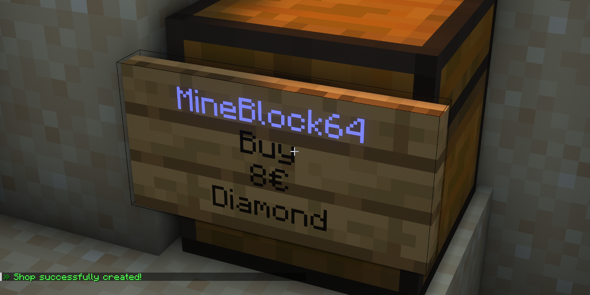

# Earth Plugin
Minecraft plugin for Earth-map SMP, which include a basic economy, chest shops, homes, towns and more!


## Features
Earth Plugin has many general purpose features as well as some features specific for Earth-map SMP.
Here's an overview of the main features of the plugin :

- Economy
- Chest Shop
- Homes
- Towns
- Ranks/Titles
- Mystery Crates
- Sit on stairs/slabs

## Usage
### Economy
To view how much money you have, you can use the ```/money``` command.

If you want to give money to someone, you have to use the ```/pay [playerName] [amount]``` command.

Every day you connect to the server, you receive a daily paycheck (25$ by default).

Using the configuration file, you can change the currency to anything you want, even currencies that don't exist in real-life!
The currency by default is the dollar ($).


### Chest Shop
To create a Chest Shop, you have to place a sign on the side of a chest.
On the first line of the sign, you have to write "*Shop*" (case-sensitive).
On the second line, you have to write either "*buy*" or "*sell*" :

- **Buy**: Other players will be able to buy items from your Chest Shop.
- **Sell**: Other players will be able to sell items to your Chest Shop.
Every time a player sells an item, they will receive the amount written on the sign of your Chest Shop.
Be careful to not go bankrupt with this!

On the third line of the sign, you have to write the price of your item per unit (e.g. if you want to sell 64 diamonds 4$ each, you write 4).
Finally, on the last line of the sign, you must write the name/id of the item. Once you click **Done**, a message should appear in the chat saying "*Shop successfully created.*".

Here's an example of what it should look like :




### Regions & local chat

#### Regions
Travelling to another continent or region on the map can take a lot of time and is not always fun.
To avoid this, you can use the region command.

The region command teleports you to a random location on one of the five continent. The command is: ```/region [region]```.
The five possible regions are: *Europe*, *Asia*, *North America*, *South America* and *Africa*.

Please note that there is a cooldown for this command, which is 6 hours by default.

#### Local chat
When you send a message in the chat, everyone on the server can see it.
If you want to send a message only to the players near you, you can use the local chat command: ```/l [message]```.
Only players within a 60 blocks radius around you will be able to see your message.


### Homes
Homes are personal locations to which you can teleport instantly at any moment.

To create a home, you have to use the ```/home create [name]``` command. You can choose any name you like for your home.

To teleport to one of your homes, use the ```/home [name]``` command.

If you want to delete of your home, you must use the ```/home delete [name]``` command. Once this home is deleted, there is no going back, so be careful.

To view the list of every home you have, simply type ```/home```.

Please note that there is a limit for how many homes you can have. This limit is by default 4.


### Towns
Towns are public locations to which you can teleport instantly whenever you want.
Once a town is created, anyone can teleport to it.

To create a town, you must use the ```/town create [name]``` command.
You can choose any name you want. Home name and town name are independent, meaning one of your home can have the same name as a town.
When creating a town, you have to pay a small fee. This fee is 40$ by default. There is also a cooldown for this command. The cooldown is 48h by default.
NOTE: If you use the Dynmap plugin alongside this plugin, every town will be displayed on the map with a little green flag.

To teleport to a town, use the ```/town [name]``` command.

To delete a town, you can use the ```/town delete [name]```. Please note that only the founder of the town can delete it.

To view the list of every town in the server, simply type ```/town```.


### Ranks/Titles
The plugin includes several ranks and titles for the players.
These are not extremely hard to get by default.
When joining the server, the player is granted the **Survivor** rank.


Here's a list of every rank and their requirement :

- **Survivor**: This rank is granted to every new player joining the server for the first time.


- **Wanderer**: Walk more than 20km on the server world.
- **Adventurer**: Walk more than 50km on the server world.
- **Conqueror**: Walk more than 100km on the server world.


- **Builder**: Place more than 2000 blocks when building.
- **Pioneer**: Place more than 8000 blocks when building.
- **Architect**: Place more than 16'000 blocks when building.


- **Diplomat**: Send more than 400 messages in the chat during discussions.
- **Emperor**: Send more than 800 message in the chat during discussions.
- **Sovereign**: Send more than 1500 messages in the chat during discussions.

Please note that these requirements are easily "farmable".
The plugin does not detect if a player is abusing these (e.g. placing/breaking the same block), and it is the responsibility of the administrators to enforce this.


### Mystery Crate
Because an Earth-map server often does not contain the traditional structures of Minecraft, many items and loots (e.g. from dungeon) cannot be .
Instead, a **Mystery Crate** containing randomly selected valuable items will drop every few hours in a random location across the map.
When a crate is dropped, an approximate location is sent to all players on the server, as well as how much time they have to find it.
Here's an example :


Even though the Mystery crates always drop on the ground (never underground or in caves), they are challenging to find.
The first player to find it receives a prize (20$ by default). If nobody find the crate within the elapsed time, the crate will disappear and so will the loot.

Here's a list of items that can possibly generate in a Mystery Crate :

- Enchanted books (20%)
- Ores/ingots (20%)
- Dungeon-style loot (50%)
- Extremely rare items (10%)


### Sit on stairs/slabs
This plugin adds the possibility to sit on stairs and slabs blocks.
To sit, simply right-click on a stair/slab block with nothing in your hand.
To stand up, use the shift key.


## Download
This plugin is made for **Spigot/Bukkit** servers. This plugin was designed to work for Minecraft **1.20.4**.

To download this plugin, click on the **Releases** tab on the right side of the screen, and select the latest version.
In the files, click the ```EarthPlugin-[version].jar``` file to download the JAR file.
This JAR file must be placed in the ```plugins``` folder of your server.

Make sure to change the world size according to your Earth world map. See **Configuration** below for more infos.


## Configuration
You can edit most of the parameters in this plugin (e.g. currency, interval between two Mystery Crates drop, etc.) using a configuration file.

The name of the file must be ```earthplugin-config.yml``` and must be placed in the same folder as the plugin JAR file.

The list of every parameter you can change can be found [here](https://github.com/vincent64/earth-plugin/blob/main/src/main/java/com/vincent64/earthplugin/Config.java).